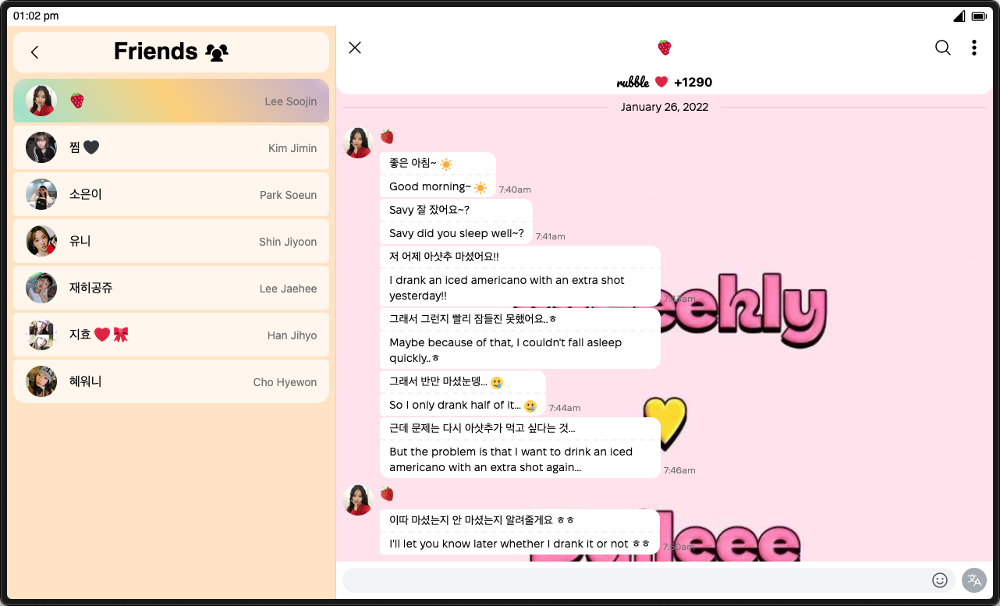

# rubble


A smol archive of Weeekly's Bubble chat messages, built with love (and a lot of help from Daileees 🫶)

check it out at [rubble.yvas.me](https://rubble.yvas.me)

## How it Works?

after Weeekly disbanded, Bubble gave fans a window to export their chat history
with the members before it was gone forever. rubble takes those plain-text `.txt`
exports and runs them through a multi-step Python pipeline:

- fan's own messages are removed entirely
- any mention of the fan's username is replaced with `[y/n]`
- message types are detected (text, photo, video, sticker, live, audio)
- timestamps are parsed and converted to KST
- each message gets a nanoid
- output is chunked into 1000-message JSON files for the frontend to load

```
raw .txt export from Bubble
          ↓
sanitize.py — removes fan messages, detects types, converts timestamps
          ↓
sanitized_chat_{member}.json
          ↓
chunk.py — splits into 1000-message chunks with metadata
          ↓
chunks/{member}/ loaded by SvelteKit
```

## Stack
| layer | tech |
| :--- | :--- |
| frontend | [SvelteKit](https://kit.svelte.dev) + [Svelte 5](https://svelte.dev) |
| backend | [Elysia.js](https://elysiajs.com) (via Bun) |
| virtualised scrolling | [virtua](https://github.com/inokawa/virtua) |
| UI components | [bits-ui](https://bits-ui.com) |
| styling | [Tailwind CSS v4](https://tailwindcss.com) |
| images | [Cloudinary](https://cloudinary.com) |
| data pipeline | Python |
| deployment | [Netlify](https://netlify.com) |

## Scripts
all commands are run from the root of the project:
| command | action |
| :--- | :--- |
| `pnpm install` | installs dependencies |
| `pnpm dev` | starts local dev server |
| `pnpm build` | builds for production |
| `pnpm preview` | builds and previews locally |
| `pnpm check` | runs svelte-check |
| `pnpm format` | formats with Prettier |
| `pnpm lint` | lints with ESLint + Prettier |
| `python scripts/sanitize.py` | parses raw `.txt`, removes fan messages, outputs JSON |
| `python scripts/chunk.py` | splits sanitized JSON into 1000-message chunks |

## Credits

special thanks to **Juwee** and **Deisi** for their early support of this project,
and to **Charisma**, **Mys**, **Deisi**, and **Juwee** for their feedback during development.

thanks to **Nana** for connecting me with **Angie**, **WeeeklyFD**, and **Khennie**,
whose generous sharing of chat exports made this archive possible. 

> fan project — not affiliated with Weeekly or IST Entertainment.

---

<div align="center">💜💛💚</div>
